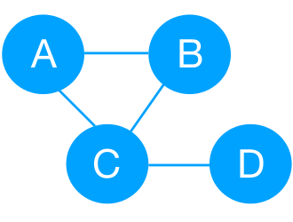

# Table of Contents
1. [Definition of the code](README.md#definition-code)
2. [Summary of approach](README.md#summary-approach)
3. [Dependencies](README.md#dependencies)
4. [Run instructions](README.md#run-instructions)

* Link to source code documentation [link](https://github.com/trangel/Data-Science/blob/master/tracking-purchases/src/README.md).
* Link to test suite documentation [link](https://github.com/trangel/Data-Science/blob/master/tracking-purchases/insight_testsuite/README.md).

# Definition of the code

This code is a real-time platform to analyze purchases within a social network of users, and detect any behavior that is far from the average within that social network.
This is a solution to the project defined at the Insight GitHub site [link.](https://github.com/InsightDataScience/anomaly_detection/blob/master/README.md)

# Summary of approach

The approach is based on object oriented programming.
A **graph** object stores the user network, while the history of purchases is recorded in a **database**. 
These objects are updated as the input files are read, and used to flag anomalous purchases.

## User network graph

The user network (see the figure above) is implemented with a graph.
The *user_network class* defines the graph and its methods.

In graph-theory terms, a user is a *graph vertex* and *graph edges* are user's friends.
The graph is implemented with python dictionaries.
Dictionaries are dynamic objects with indexed entries, which allow for fast access to data, and hence are ideal for graphs.
For more details on the user network class, see 
[user network class](http://htmlpreview.github.com/?https://github.com/trangel/Data-Science/blob/master/tracking-purchases/src/user_network.html).

## Database of purchases

| Timestamp            | id | amount |
| -------------------- |:---| ------:|
| 2017-06-13 11:33:01  | 1  | 16.83  |
| 2016-06-13 11:32:02  | 2  | 122.00 |

A pandas database, as shown above, is used to keep track of the history of purchases.
The database is updated every time a new purchase arrives.
To fascilitate data analysis, the data is sorted by timestamp and order of appearance.

### Keeping a small database
A strategy I followed to improve performance is to keep the size of the database small.
For large databases, performance can be drastically deteriorated. 
Therefore, I drop the oldest entries, while keeping only the entries which are actually used to tag purchases as anomalous. 
See details in
[database_operations](http://htmlpreview.github.com/?https://github.com/trangel/Data-Science/blob/master/tracking-purchases/src/database_operations.html).

For more details on the source code, see [link](https://github.com/trangel/Data-Science/blob/master/tracking-purchases/src/README.md).

## Parser

While input files are parsed, each line is saved into a python dictionary.
The *event_type* dictionary key is read, and then the corresponding routine is called for each kind of event.
See details of the parser in [parser](http://htmlpreview.github.com/?https://github.com/trangel/Data-Science/blob/master/tracking-purchases/src/parser.html).

* For *unfriend* and *friend* events, functions of the *user network* class are called to update the network of users: users can be added, friends are updated. Moreover, the user network of friends of a given degree is updated.
See details in
[user network class](http://htmlpreview.github.com/?https://github.com/trangel/Data-Science/blob/master/tracking-purchases/src/user_network.html).

* For a *purchase* event, the purchases database is updated as explained above.
If reading the *stream_log* file, purchase analysis are calculated to decide whether or not the purchase is anomalous.
For the fast calculation of purchase statistics, the data is passed in numpy arrays. 
See details in
[purchase statistics](http://htmlpreview.github.com/?https://github.com/trangel/Data-Science/blob/master/tracking-purchases/src/purchase_statistics.html).

# Dependencies

The following packages are required:

* python 3.6
* pandas
* numpy
* json

# Run instructions

With default input/output files:

`python src/anomaly_detection.py` 

By default the input/output file names are: *batch\_log.json*, *stream\_log.json* and *flagged\_purchases.json*.
Note that input files are always in directory *input\_log* and output files are in *output\_log*.

You can define the names of input/output files:

`python src/anomaly\_detection.py -i1 <batch_log_fname> -i2 <stream_log_fname> -o <output_fname>`

